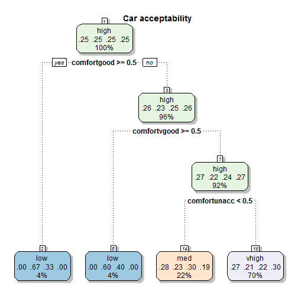

## Car Acceptability 

--- .class #id

## Introduction

> * The data used in the project is retreived from car.data dataset provided in the R "datasets" package.
> * There are 7 variables in the dataset (Car acceptability, Price, Doors, Persons, Space for luggage, Safety, Comfort)
> * The number of observations is 1728

|&#124;  Car acceptability  &#124; |&#124;  Price   &#124; |&#124;  Doors   &#124; |&#124;  Persons   &#124; |&#124;  Luggage Boot   &#124; |&#124;  Safety   &#124; |&#124;  Comfort   &#124; |
|:---------------------------------|:----------------------|:----------------------|:------------------------|:-----------------------------|:-----------------------|:------------------------|
|vhigh                             |vhigh                  |2                      |2                        |small                         |low                     |unacc                    |
|vhigh                             |vhigh                  |2                      |2                        |small                         |med                     |unacc                    |
|vhigh                             |vhigh                  |2                      |2                        |small                         |high                    |unacc                    |
|vhigh                             |vhigh                  |2                      |2                        |med                           |low                     |unacc                    |
|vhigh                             |vhigh                  |2                      |2                        |med                           |med                     |unacc                    |
|vhigh                             |vhigh                  |2                      |2                        |med                           |high                    |unacc                    |

--- .class #id

## App features
> * Easy to modify the model
> * Option to modify the variables which are included in the model
> * Max depth parameter for fine tuning the model
> * Great way to visualize the solution
> * Easy to determine which factors are important for determining the car accessability
> * You can access the application by visiting: https://lennyvis.shinyapps.io/Specialization

--- .class #id

## Example of a visualized model
 

--- .class #id

## Conclusion

> * Comfort is the most important parameter when determining the car acceptability level
> * Changing the depth level for the tree affects the model
> * The depth of the tree is affected by the number of parameters we choose

--- .class #id
